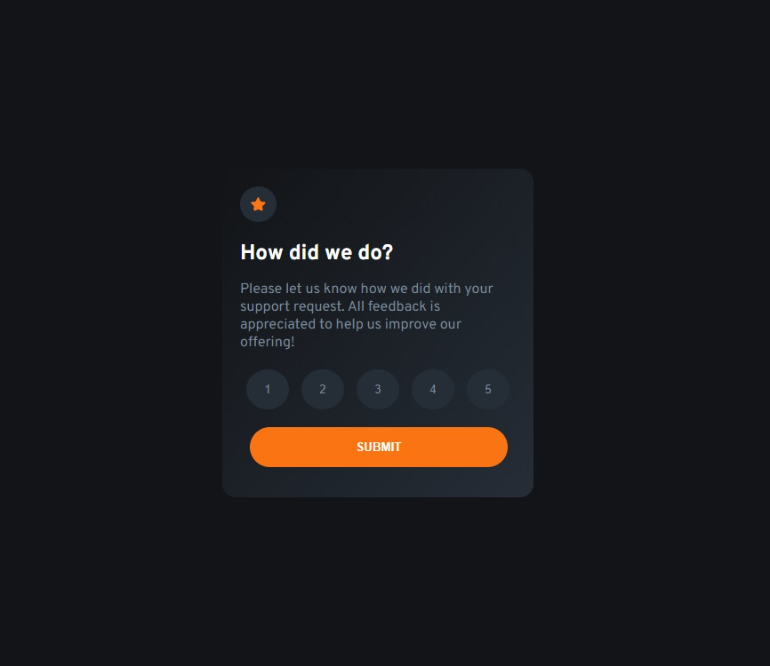
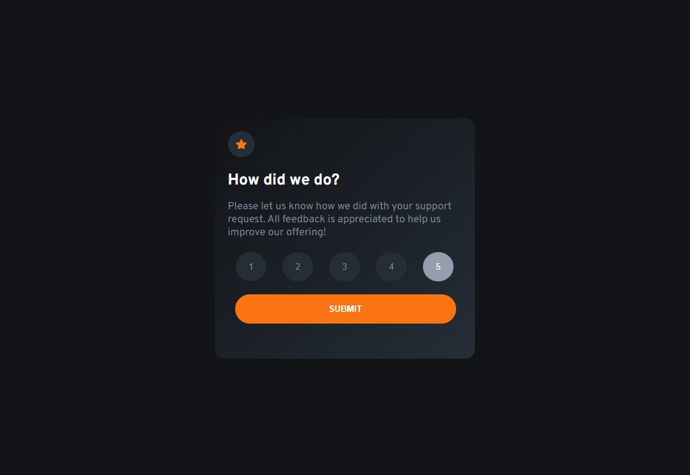

# Frontend Mentor - Interactive rating component solution

This is a solution to the [Interactive rating component challenge on Frontend Mentor](https://www.frontendmentor.io/challenges/interactive-rating-component-koxpeBUmI). Frontend Mentor challenges help you improve your coding skills by building realistic projects.

## Table of contents

- [Overview](#overview)
  - [The challenge](#the-challenge)
  - [Screenshot](#screenshot)
  - [Links](#links)
- [My process](#my-process)
  - [Built with](#built-with)
  - [What I learned](#what-i-learned)
  - [Continued development](#continued-development)
  - [Useful resources](#useful-resources)
- [Author](#author)

## Overview

### The challenge

Users should be able to:

- View the optimal layout for the app depending on their device's screen size
- See hover states for all interactive elements on the page
- Select and submit a number rating
- See the "Thank you" card state after submitting a rating

### Screenshot




### Links

- Solution URL: [Add solution URL here](https://github.com/felipe1590/interactive-rating)
- Live Site URL: [Add live site URL here](https://felipe1590.github.io/interactive-rating/)

## My process

### Built with

- Semantic HTML5 markup
- CSS custom properties
- Flexbox
- Mobile-first workflow

### What I learned

Having defined the design in this way, I created a class responsible for hiding the first page containing the class. As soon as a note was selected, I used a variable to assign the value and call it on the final screen.

```html
<section id="final-rating" class="displayOff">
  
  <p id="rating">You selected 0 out of 5</p>
  <h2>Thank you!</h2>
  <p>
    We appreciate you taking the time to give a rating. If you ever need more
    support, don’t hesitate to get in touch!
  </p>
</section>
```

```css
.displayOff {
  display: none;
}
```

```js
btnSubmit.addEventListener("click", () => {
  finalRating(btnAtivo);
});

function finalRating(rating) {
  if (rating !== 0) {
    page1.classList.add("displayOff");
    page2.classList.remove("displayOff");

    ratingFinal.textContent = `You selected ${btnAtivo} out of 5`;
  }
}
```

### Continued development

I'm focusing on improving my JavaScript skills to get better with React.js and become a better programmer, developing my knowledge in a structured way and focusing on the applied study of the front-end.

### Useful resources

- [Front-end with React](https://ada.tech/) - He helped me by giving me the basics of the whole JavaScript context and introducing me to React.js to start being a front-end programmer.

## Autor

- Website - [Felipe Gama](https://felipe1590.github.io/portfolio/)
- Frontend Mentor - [@felipe1590](https://www.frontendmentor.io/profile/felipe1590)
- Linkedin - [Felipe Gama](https://www.linkedin.com/in/felipe-gama-3a5638265/)
